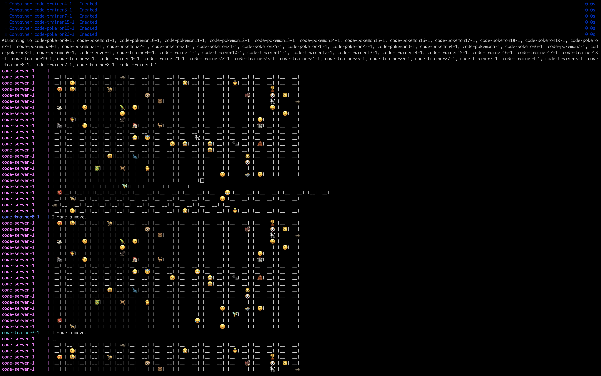

# cs5113fa22-project

# Name: Rithsek Ngem
## How to run the code:
    1. python3 create-docker-compose.py --b 20 --t 28 --p 28
    2. docker-compose up --build

## Development Schedule
- completed architecture descrition [10/27] - 2h
- spend 5h to design interface and write protoc file by [11/03]
- spend 3h to write the first version logging by [11/17]
- spend 12h to finish the project by [12/01]
- spend 2h preparing the final presentation by [12/14]

## Emoji Chooser
- create a 2d array of N*N to initalize the board
- each trainer will take different emoji from available human emoji
- each pokemon will take different emoji from available animal emoji list
- size of board, pokemon and trainer: N = 20, T = P 28

this will create 1 server machine that control the board, 28 machines for pokemon and 28 machines for Trainer which is 58 docker containers during the run. 

## Dockercompose.yml: 
- docker-compose.yml is created dynamically using python scription call 'create-docker-compose.py' which the arugment of (--b --t --p) as board size, number of trainer and number of pokemon respectively. When running this file it will create a docker-compose.yml that has t+p+1 services. This python file also write a map of each docker-container name create to a corresponding emoji and store as configFile in 'config.ini' which is used later in the 'node.py'

## Dockerfile: 
- build on top of Ubuntu base image, install all the deps requriments and command to run `node.py`
## Protocol Buffer: 
- create services rpc that allow Trainer and Pokeman communicate with Server. 
    1. rpc check_board (name) returns (check_position): trainer or pokemon request to server to check the board and server will reply with 
        repeated int32 x = 1; # indicate surrounding 8 blocks: -1 cant move, 0 is free, 1 can pokemon there
        string lock = 2; # the lock key to make sure one trainer/pokemon can move a time
        int32 alive = 3; # for pokemone to check if it still alive
        int32 pokemon_left = 4; # check if there is still pokemon left, otherwise exit
        repeated int32 current_position = 5; # the current postion of trainer/pokemon
    2. rpc move (move_position) returns (complete_move):
        trainer/pokemon can request to move to a 'move_position' and complete_move = 1 if success
    3. rpc list_pokemon (name) returns (captured_pokemon)
        for trainer to check the list of pokemon it has capture
    4. rpc list_trainer (name) returns (trainer_info)
        for pokemon to check who capture it
    5. rpc path (name) returns (path_info)
        for trainer/pokemon to request the they have moved

## Node.py:
### create_board:
    - this function load `config.ini` file to create N by N board and assign trainer and pokemon randomly 
    - it return tuple of `board` `board-size` and `number of pokemon`
### class Pokemonou 
    - this class implement all the grpc services compiled from protofile 
    #### check_board:
        - receive the hostname and return where the trainer/pokemon can move and how many pokemon left on the board
    ### move
        - receive the hostname and the position it wants to move, the server update the board and check if pokemons are caputured. This will also update the global variable `pokedex` and `path_` which store the information of who capture who and the path they travelled 
    ### list_pokemon
        - this function recieve the hostname and return the trainer of all the pokemons it has captured
    ### list_trainer
        -- this function recieve the hostname of pokemon and return the informationa of trainer that captured along where it got captured
    ### path
        -- when the game about the exit, trainer/pokemon call the function to print all the position they travelled across the board.
### serve
    - this function use grpc and `Pokemonou` to create a channel that listen the request from trainers/pokemons
    - it does terminate until `ctr+c` command 
### trainer
    - this function responsible for the trainer's request operation, 
    - it terminate when no pokemon left on the board
    - it use `async`, `async.aio` and `await` keywords from asyncio library for the project to run in asynchronouse enviornment. 
### pokemon 
    - this function responsible for the pokemon's request operation, 
    - it terminate when no pokemon left on the board
    - it use `async`, `async.aio` and `await` keywords from asyncio library for the project to run in asynchronouse enviornment. 

### Logging

it creates 59 docker containers, the server assign 56 emojis to board and each trainer/pokemon start moving one by one untill all the pokemon are caputured by trainers. 
